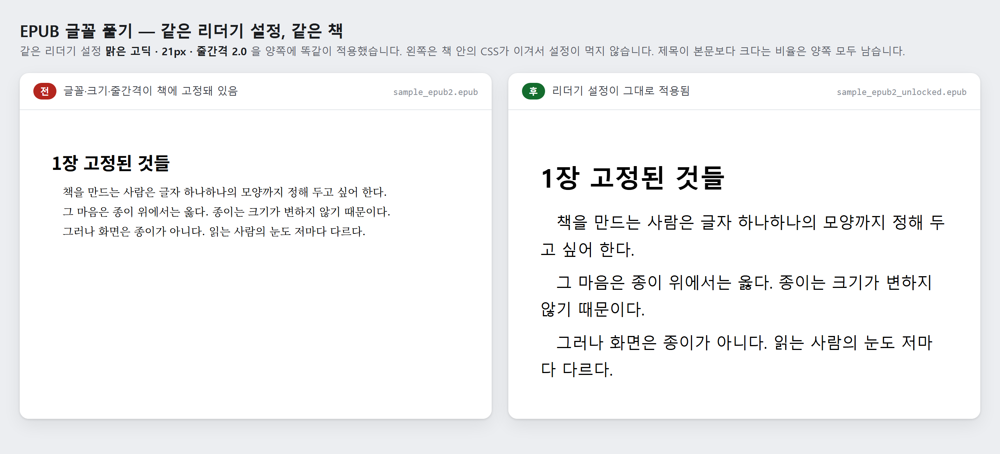

# しおりツール – EPUBフォント解除

[한국어](README.md) · [English](README.en.md) · [中文](README.zh-CN.md)

EPUBに固定されたフォント・文字サイズ・行間を取り除き、電子書籍リーダーのフォント設定がそのまま効くようにします。本文は一文字も変えません。サーバー不要、インストール不要、元ファイルは一切変更しません。

> **DRM保護されたEPUBは処理しません。** 書店で購入した本のほとんどが該当します。DRMの解除も回避も行わず、知らせてスキップするだけです。ただし、SigilやInDesignがフォントを埋め込むときに使う**フォントの難読化**はDRMではないので、そのような本は処理します。



同じリーダー設定（맑은 고딕・21px・行間 2.0）を両側に適用しています。左は本の中のCSSが勝って設定が効かず、右は設定がそのまま適用されます。見出しが本文より大きいという比率は両側とも残っています。`samples/sample_epub2.epub` を実際に処理してレンダリングしたもので、`python docs/make_before_after.py` で作り直せます。

## ダウンロード

- **実行ファイル**: [Releases](https://github.com/microhan1/epub-font-unlock/releases) から `epub-font-unlock.exe` をダウンロードしてダブルクリック。インストール不要です。
- **ソースから実行**:

```bash
pip install -r requirements.txt
python main.py
```

## 使い方

1. EPUBファイルまたはフォルダーをウィンドウにドロップします。
2. **解析結果**に「固定フォント 3 種、絶対サイズ 12 箇所、絶対行間 4 箇所」のように、何が固定されているかが先に表示されます。
3. 解除する項目を確認して**実行**を押すと、元ファイルの隣に `<元の名前>_unlocked.epub` ができます。

既定ではフォント・サイズ・行間の3つだけが有効です。余白の整理と埋め込みフォントファイルの削除はオフです。

```bash
python main.py book.epub --font --size --line-height
python main.py 本のフォルダー --analyze-only
python main.py book.epub --font --size --line-height --margin --remove-font-files
```

`python main.py --help` はOSの言語（한국어 · English · 中文 · 日本語）でオプションを表示します。

## 何を消すか

| 項目 | 消すもの | 残すもの |
|---|---|---|
| フォント | `font-family` | 埋め込みフォントファイルと `@font-face`（オプションで削除） |
| 文字サイズ | `font-size` の px・pt・cm などの絶対値 | `em`、`%`、`rem`、`larger` などの相対値 |
| 行間 | `line-height` の絶対値 | 単位なしの数値、`%`、`em` |
| 余白（オプション） | `p`、`div` の `margin`・`padding` の絶対値 | `0`、相対値、`auto`（中央揃え）、表や図の余白 |

見出しが本文より大きいという約束（相対値）は処理後もそのまま残ります。CSSファイル、XHTML内の `<style>` ブロック、タグの `style="..."` 属性に同じ規則を適用します。

## しないこと

- 本文のテキストは変えません。
- DRM保護されたEPUBは開きません。知らせるだけです。`META-INF/encryption.xml` があっても、中身がすべてフォントの難読化である場合に限ってDRMではないと見なします。ほかの方式が1つでも混ざっている、またはファイルを読めない場合はDRMとして扱いスキップします。
- EPUB2とEPUB3の変換や、構造の作り直しはしません。
- 表紙、目次（NCX・nav）、メタデータ（OPF）には触れません。唯一の例外は、埋め込みフォントファイルを削除するときに、消えたファイルを指すOPFのmanifest項目と `encryption.xml` の項目も一緒に消すことです。そうしないとepubcheckを通りません。

## シリーズ

- しおりツール: [スキャンPDF補正](https://github.com/microhan1/scan-pdf-cleanup) · [余白カット](https://github.com/microhan1/TrimPDF) · [見開き分割](https://github.com/microhan1/scan-pdf-split)
- [しおりライブラリ（Chaekgalpi Library）](https://chaekgalpi.co.kr/tools/epubfont?utm_source=github&utm_medium=referral&utm_campaign=tool_cta&utm_content=epubfont) — 読んだ本と読書記録を残すウェブサービス（韓国語のみ）

## ライセンス

MIT。[LICENSE](LICENSE) を参照してください。

配布している exe には Python、Tcl/Tk などのサードパーティ製コンポーネントも含まれています。コンポーネントとライセンス全文は [THIRD_PARTY_LICENSES.txt](THIRD_PARTY_LICENSES.txt) にあります。
